Bellabeat Case
================
Mustafa Yazar
11/14/2021

-   [ASK](#ask)
-   [PREPARE](#prepare)
    -   [Information About Data](#information-about-data)
-   [PROCESS](#process)
-   [ANALYZE AND VISUALIZE](#analyze-and-visualize)
    -   [INSIGHTS](#insights)

# ASK

### Company Information

Bellabeat is the go-to wellness brand for women with an ecosystem of
products and services focused on women’s health. According to company’s
site “They develop wearables and accompanying products that monitor
biometric and lifestyle data to help women better understand how their
bodies work and make healthier choices.”

### Product Information

-   Bellabeat app: The Bellabeat app provides users with health data
    related to their activity, sleep, stress, menstrual cycle, and
    mindfulness habits. This data can help users better understand their
    current habits and make healthy decisions. The Bellabeat app
    connects to their line of smart wellness products.

-   Leaf: Bellabeat’s classic wellness tracker can be worn as a
    bracelet, necklace, or clip. The Leaf tracker connects to the
    Bellabeat app to track activity, sleep, and stress.

-   Time: This wellness watch combines the timeless look of a classic
    timepiece with smart technology to track user activity, sleep, and
    stress. The Time watch connects to the Bellabeat app to provide you
    with insights into your daily wellness.

-   Spring: This is a water bottle that tracks daily water intake using
    smart technology to ensure that you are appropriately hydrated
    throughout the day. The Spring bottle connects to the Bellabeat app
    to track your hydration levels. I chose to work on the Time product.

### Key Stakeholders

-   Urška Sršen: Bellabeat’s cofounder and Chief Creative Officer

-   Sando Mur: Mathematician and Bellabeat’s cofounder; key member of
    the Bellabeat executive team

### Identifying the Problem

Bellabeat has grown rapidly in the last few years. Stakeholders wants to
learn about new growth opportunities and they need information about the
customer usage trends for a new marketing strategy.

### Business Task

Focus on one of the Bellabeat’s products and analyze smart device data
to gain insights into how consumers are using their smart devices.Make
recommendations for how these trends can inform the company marketing
strategy. Use the data to discover more growth opportunities for the
company.

### Guiding Questions

1.  What are some trends in smart device usage?
2.  How could these trends apply to Bellabeat customers?
3.  How could these trends help influence Bellabeat marketing strategy?

# PREPARE

## Information About Data

I will use FitBit Fitness Tracker Public Datasets for the analysis.
These datasets were generated by respondents to a distributed survey via
Amazon Mechanical Turk between 03.12.2016-05.12.2016. Thirty three
eligible Fitbit users consented to the submission of personal tracker
data, including minute-level output for physical activity, heart rate,
and sleep monitoring. You can find the data
[here](https://www.kaggle.com/arashnic/fitbit)

Let’s start to prepare the data for analysis.

### Loading Packages

``` r
library(tidyverse)
library(lubridate)
```

### Importing Data

``` r
daily_activity <- read_csv("dailyActivity_merged.csv",show_col_types = FALSE)
daily_calories <- read_csv("dailyCalories_merged.csv",show_col_types = FALSE)
daily_intensities <-  read_csv("dailyIntensities_merged.csv",show_col_types = FALSE)
daily_steps <- read_csv("dailySteps_merged.csv",show_col_types = FALSE)
heartrate <-  read_csv("heartrate_seconds_merged.csv",show_col_types = FALSE)
sleep <-  read_csv("sleepDay_merged.csv",show_col_types = FALSE)
weight<-  read_csv("weightLogInfo_merged.csv",show_col_types = FALSE)
```

Let’s see what variables each data contains.

``` r
colnames(daily_activity)
```

    ##  [1] "Id"                       "ActivityDate"            
    ##  [3] "TotalSteps"               "TotalDistance"           
    ##  [5] "TrackerDistance"          "LoggedActivitiesDistance"
    ##  [7] "VeryActiveDistance"       "ModeratelyActiveDistance"
    ##  [9] "LightActiveDistance"      "SedentaryActiveDistance" 
    ## [11] "VeryActiveMinutes"        "FairlyActiveMinutes"     
    ## [13] "LightlyActiveMinutes"     "SedentaryMinutes"        
    ## [15] "Calories"

``` r
colnames(daily_calories)
```

    ## [1] "Id"          "ActivityDay" "Calories"

``` r
colnames(daily_intensities)
```

    ##  [1] "Id"                       "ActivityDay"             
    ##  [3] "SedentaryMinutes"         "LightlyActiveMinutes"    
    ##  [5] "FairlyActiveMinutes"      "VeryActiveMinutes"       
    ##  [7] "SedentaryActiveDistance"  "LightActiveDistance"     
    ##  [9] "ModeratelyActiveDistance" "VeryActiveDistance"

``` r
colnames(daily_steps)
```

    ## [1] "Id"          "ActivityDay" "StepTotal"

``` r
colnames(weight)
```

    ## [1] "Id"             "Date"           "WeightKg"       "WeightPounds"  
    ## [5] "Fat"            "BMI"            "IsManualReport" "LogId"

``` r
colnames(sleep)
```

    ## [1] "Id"                 "SleepDay"           "TotalSleepRecords" 
    ## [4] "TotalMinutesAsleep" "TotalTimeInBed"

``` r
colnames(heartrate)
```

    ## [1] "Id"    "Time"  "Value"

# PROCESS

We will also look at each data to see how many distinct user it
contains.

``` r
n_distinct(daily_activity$Id)
## [1] 33
n_distinct(daily_calories$Id)
## [1] 33
n_distinct(daily_steps$Id)
## [1] 33
n_distinct(daily_intensities$Id)
## [1] 33
n_distinct(heartrate$Id)
## [1] 7
n_distinct(sleep$Id)
## [1] 24
n_distinct(weight$Id)
## [1] 8
```

As we can see from the results heart rate data and weight data only
contains 7 or 8 people. This much data will not give us any good
insights.

Also we can see that daily activity data might contain the variables of
other daily data files. Let’s check if they match with each other.

``` r
sum(daily_steps$Id==daily_activity$Id)
## [1] 940
sum(daily_steps$StepTotal==daily_activity$TotalSteps)
## [1] 940
sum(daily_calories$Id==daily_activity$Id)
## [1] 940
sum(daily_calories$Calories==daily_activity$Calories)
## [1] 940
sum(daily_intensities$Id==daily_activity$Id)
## [1] 940
sum(daily_intensities$FairlyActiveMinutes==daily_activity$FairlyActiveMinutes)
## [1] 940
```

Let’s also check the firs few columns if they really match.

``` r
select(daily_activity,Id,TotalSteps,Calories,FairlyActiveMinutes)
## # A tibble: 940 x 4
##            Id TotalSteps Calories FairlyActiveMinutes
##         <dbl>      <dbl>    <dbl>               <dbl>
##  1 1503960366      13162     1985                  13
##  2 1503960366      10735     1797                  19
##  3 1503960366      10460     1776                  11
##  4 1503960366       9762     1745                  34
##  5 1503960366      12669     1863                  10
##  6 1503960366       9705     1728                  20
##  7 1503960366      13019     1921                  16
##  8 1503960366      15506     2035                  31
##  9 1503960366      10544     1786                  12
## 10 1503960366       9819     1775                   8
## # ... with 930 more rows
select(daily_steps,Id,StepTotal)
## # A tibble: 940 x 2
##            Id StepTotal
##         <dbl>     <dbl>
##  1 1503960366     13162
##  2 1503960366     10735
##  3 1503960366     10460
##  4 1503960366      9762
##  5 1503960366     12669
##  6 1503960366      9705
##  7 1503960366     13019
##  8 1503960366     15506
##  9 1503960366     10544
## 10 1503960366      9819
## # ... with 930 more rows
select(daily_calories,Id,Calories)
## # A tibble: 940 x 2
##            Id Calories
##         <dbl>    <dbl>
##  1 1503960366     1985
##  2 1503960366     1797
##  3 1503960366     1776
##  4 1503960366     1745
##  5 1503960366     1863
##  6 1503960366     1728
##  7 1503960366     1921
##  8 1503960366     2035
##  9 1503960366     1786
## 10 1503960366     1775
## # ... with 930 more rows
select(daily_intensities,Id,FairlyActiveMinutes)
## # A tibble: 940 x 2
##            Id FairlyActiveMinutes
##         <dbl>               <dbl>
##  1 1503960366                  13
##  2 1503960366                  19
##  3 1503960366                  11
##  4 1503960366                  34
##  5 1503960366                  10
##  6 1503960366                  20
##  7 1503960366                  16
##  8 1503960366                  31
##  9 1503960366                  12
## 10 1503960366                   8
## # ... with 930 more rows
```

We can clearly see that daily activities file contains all of the daily
data. So, we will not be using other daily files. We will only use
daily_activity and sleep for our analysis.

Let’s sort and filter our data. Before we sort the data we must format
the ActivityDate and merge the 2 data we have. First we have to format
our date columns.

``` r
daily_activity <- daily_activity %>% 
  mutate(ActivityDate = as.Date(ActivityDate,format='%m/%d/%Y') ) %>%
  rename(Date = ActivityDate)

sleep <- sleep %>%
  mutate (SleepDay = as.Date(SleepDay,format='%m-%d-%Y')) %>%
  rename(Date = SleepDay)

merged_data <- left_join(daily_activity,sleep,by=c("Id","Date"))
head(merged_data)
```

    ## # A tibble: 6 x 18
    ##        Id Date       TotalSteps TotalDistance TrackerDistance LoggedActivitiesD~
    ##     <dbl> <date>          <dbl>         <dbl>           <dbl>              <dbl>
    ## 1  1.50e9 2016-04-12      13162          8.5             8.5                   0
    ## 2  1.50e9 2016-04-13      10735          6.97            6.97                  0
    ## 3  1.50e9 2016-04-14      10460          6.74            6.74                  0
    ## 4  1.50e9 2016-04-15       9762          6.28            6.28                  0
    ## 5  1.50e9 2016-04-16      12669          8.16            8.16                  0
    ## 6  1.50e9 2016-04-17       9705          6.48            6.48                  0
    ## # ... with 12 more variables: VeryActiveDistance <dbl>,
    ## #   ModeratelyActiveDistance <dbl>, LightActiveDistance <dbl>,
    ## #   SedentaryActiveDistance <dbl>, VeryActiveMinutes <dbl>,
    ## #   FairlyActiveMinutes <dbl>, LightlyActiveMinutes <dbl>,
    ## #   SedentaryMinutes <dbl>, Calories <dbl>, TotalSleepRecords <dbl>,
    ## #   TotalMinutesAsleep <dbl>, TotalTimeInBed <dbl>

We will first sort by Id the Date. Also we will exclude the Sedentary
Active Distance and Logged Activities Distance from the data as most of
them are 0.

``` r
sorted_data <- merged_data %>%
  arrange(Id,Date) %>%
  select(-SedentaryActiveDistance,-LoggedActivitiesDistance) %>%
  rename(ActivityDate = Date)
```

# ANALYZE AND VISUALIZE

Let’s explore our data. We will start with summarizing the data.

``` r
sorted_data %>%
  select(-Id,-ActivityDate) %>%
  summarise_each(funs(mean)) %>%
  print(width=400)
```

    ## # A tibble: 1 x 14
    ##   TotalSteps TotalDistance TrackerDistance VeryActiveDistance
    ##        <dbl>         <dbl>           <dbl>              <dbl>
    ## 1      7652.          5.50            5.49               1.50
    ##   ModeratelyActiveDistance LightActiveDistance VeryActiveMinutes
    ##                      <dbl>               <dbl>             <dbl>
    ## 1                    0.571                3.35              21.2
    ##   FairlyActiveMinutes LightlyActiveMinutes SedentaryMinutes Calories
    ##                 <dbl>                <dbl>            <dbl>    <dbl>
    ## 1                13.6                 193.             990.    2308.
    ##   TotalSleepRecords TotalMinutesAsleep TotalTimeInBed
    ##               <dbl>              <dbl>          <dbl>
    ## 1                NA                 NA             NA

``` r
sorted_data %>% group_by(ActivityDate) %>%
  summarise(TotalSteps = mean(TotalSteps))  %>%
  ggplot(aes(x=ActivityDate,y=TotalSteps)) + geom_col()+ggtitle("Average Total Steps Time Series")
```

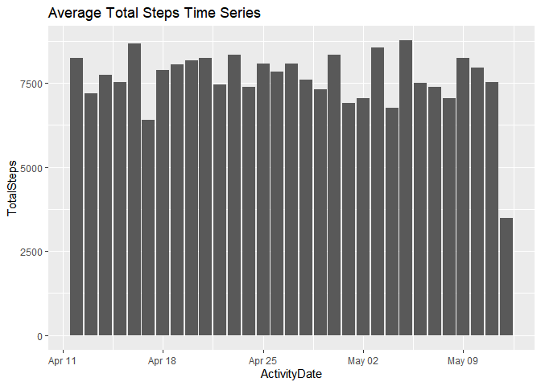<!-- -->

``` r
sorted_data %>% 
  select(TotalMinutesAsleep, TotalTimeInBed)%>%
  drop_na() %>%
  summarise_each(funs(mean))
```

    ## # A tibble: 1 x 2
    ##   TotalMinutesAsleep TotalTimeInBed
    ##                <dbl>          <dbl>
    ## 1               419.           459.

``` r
ggplot(sorted_data,aes(x=TotalTimeInBed,y=TotalMinutesAsleep)) + geom_jitter()+ geom_smooth()+ggtitle("Total Time in Bed vs Total Minutes Asleep")
```

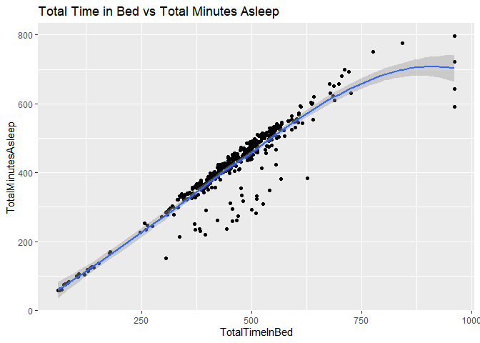<!-- -->

``` r
ggplot(sorted_data) + geom_histogram(aes(x=TotalMinutesAsleep),binwidth = 50) + ggtitle("Total Minutes Asleep")
```

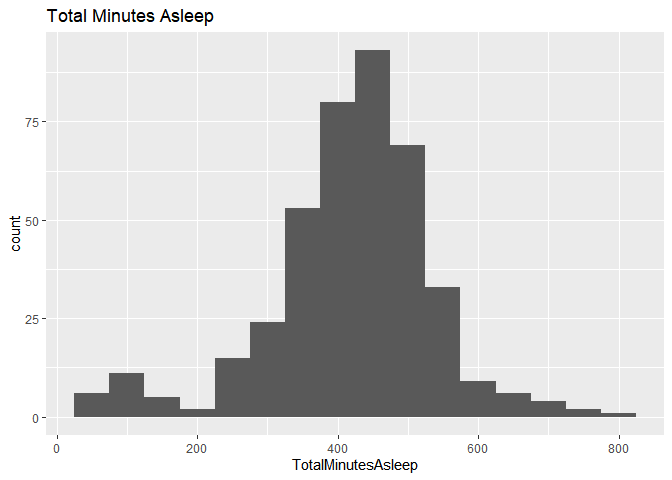<!-- -->

``` r
ggplot(sorted_data)+ geom_histogram(aes(x=SedentaryMinutes),binwidth = 60) + ggtitle("Sedentary Minutes")
```

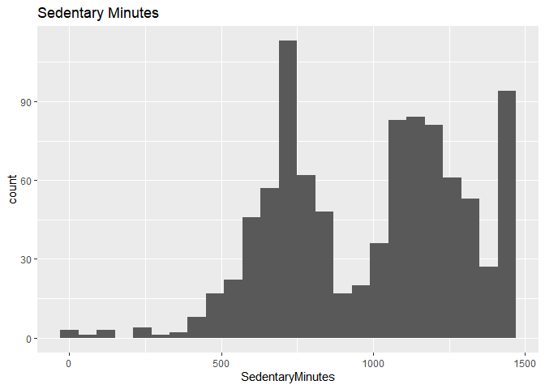<!-- -->

``` r
ggplot(sorted_data) + geom_histogram(aes(x=TotalSteps),binwidth = 1500)+ggtitle("Total Steps")
```

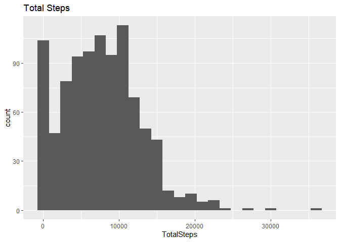<!-- -->

Some key points from the summaries: \* Users have average daily total
steps of 7562.

-   Average sedentary minutes are 990 but lightly active minutes are
    193.Total active minutes are 228. Majority of the users are
    Sedentary most of the day. Users are active averagely in 19% of the
    day that they are using the tracker.

-   Average daily loss of calories 2307.

-   Most of the user sleep between 300 minutes to 600 minutes. Average
    sleep time for users is 419 minutes. Total time in bed is 458
    minutes. Users sleep in 39 minutes after they go to bed. There are
    some outliers in the sleep data. Some people slept less than 200
    minutes in some days and some people slept more than 700 minutes.
    These outliers need to be investigated or need to be deleted from
    the data.

Let’s see if there are any correlations between variables

``` r
sorted_data %>%
  group_by(Id) %>%
  summarize(StepsvCalories=cor(TotalSteps,Calories)) %>%
  summarize(mean=mean(StepsvCalories))
```

    ## # A tibble: 1 x 1
    ##    mean
    ##   <dbl>
    ## 1 0.834

``` r
ggplot(sorted_data,aes(x=TotalSteps,y=Calories)) + geom_jitter() + geom_smooth()+ggtitle("Total Steps vs Calories Lost")
```

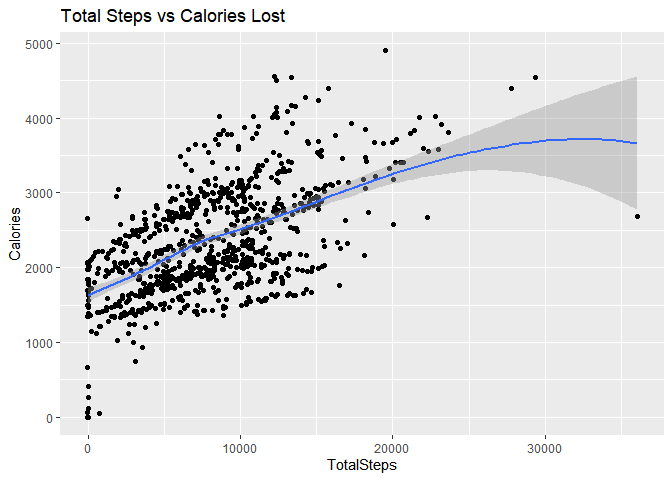<!-- -->

``` r
sorted_data %>%
  group_by(Id) %>%
  drop_na() %>%
  summarize(SleepvSteps=cor(TotalMinutesAsleep,TotalSteps)) %>%
  drop_na() %>%
  summarize(mean2=mean(SleepvSteps))
```

    ## # A tibble: 1 x 1
    ##    mean2
    ##    <dbl>
    ## 1 -0.144

``` r
ggplot(sorted_data,aes(x=TotalMinutesAsleep,TotalSteps)) + geom_jitter()+geom_smooth()+ggtitle("Total Sleep vs Total Steps")
```

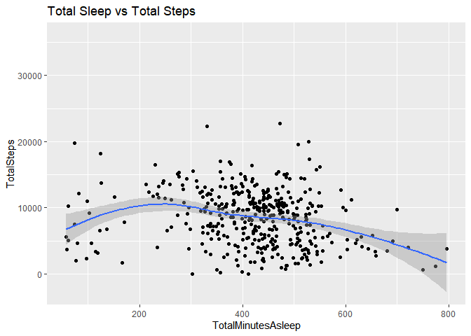<!-- -->

Let’s divide our user in to segments based on their activity levels.
First we will add an Total Usage column and then find the percentage for
each segment. After that we will create new dataset with our segments.

``` r
Segments_data<-sorted_data %>%
  mutate(TotalUsage = VeryActiveMinutes + FairlyActiveMinutes + LightlyActiveMinutes + SedentaryMinutes,VeryActive = VeryActiveMinutes/TotalUsage*100, FairlyActive = FairlyActiveMinutes/TotalUsage*100, LightlyActive = LightlyActiveMinutes/TotalUsage*100, Sedentary = SedentaryMinutes/TotalUsage*100) %>%
  group_by(Id) %>%
  summarise(VeryActive = round(mean(VeryActive),2),FairlyActive = round(mean(FairlyActive),2), LightlyActive = round(mean(LightlyActive),2), Sedentary = round(mean(Sedentary),2)) %>%
  mutate(Segment = case_when(Sedentary>83 ~ "Sedentary",VeryActive >= 3.5 ~ "Very Active", FairlyActive > 2 ~ "Fairly Active", LightlyActive>20 ~ "Lightly Active",VeryActive >2 ~ "Fairly Active"))

User_data <- left_join(sorted_data,Segments_data,by = "Id") 
```

Let’s see how much user each segment contains and see their average
sleep time to see if there is a difference between each other.

``` r
user_segments <- User_data %>% 
 group_by(Segment) %>%
  distinct(Id) %>%
  count(Segment)
ggplot(user_segments,aes(x=Segment,y=n,fill=Segment)) + geom_col()+ggtitle("Users by Segments")
```

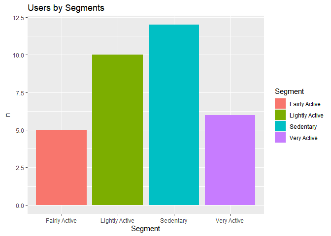<!-- -->

``` r
User_data%>%
  select(Segment,TotalMinutesAsleep) %>%
  drop_na() %>%
  group_by(Segment) %>%
  summarise(averagesleep = mean(TotalMinutesAsleep)) %>%
  ggplot(aes(x=Segment,y=averagesleep,fill=Segment)) + geom_col()+ggtitle("Average Sleep Time for Segments")
```

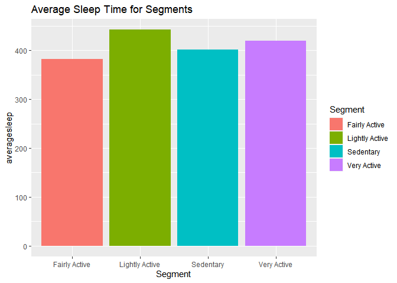<!-- -->

There is not an important difference in sleep time between segments. We
can conclude that activity does not affect the sleep time. Let’s the
relationship between segments and other metrics.

``` r
User_data %>%
  select(Segment,Calories) %>%
  group_by(Segment) %>%
  summarise(avgcalories = mean(Calories)) %>%
  ggplot(aes(x=Segment,y=avgcalories,fill=Segment)) + geom_col()+ggtitle("Average Calories Lost  for Segments")
```

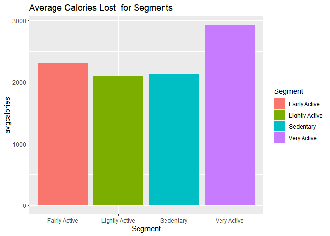<!-- -->

-   We can see that the more you are active, more you lose calories.
    This is the reasonable conclusion, of course.

Now I want to know that if active user spend less time in bed to sleep.

``` r
User_data %>%
  select(Segment,TotalMinutesAsleep,TotalTimeInBed) %>%
  drop_na() %>%
  mutate(TimetoSleep = TotalTimeInBed - TotalMinutesAsleep) %>%
  group_by(Segment) %>%
  summarise(avgtimetosleep = mean(TimetoSleep))  %>%
  ggplot(aes(x=Segment,y=avgtimetosleep,fill=Segment)) + geom_col() +ggtitle("Average Time to Sleep for Segments")
```

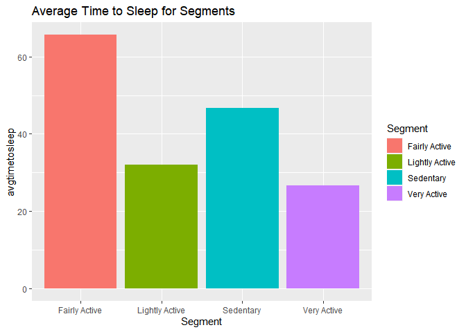<!-- -->

-   Despite that lightly active and very active users can sleep earlier
    than sedentary users, fairly active user are the most time spending
    segment in the data. We can’t conclude that activity affects time to
    fall asleep. But we can investigate the relationship between
    sedentary time and time to fall asleep.

``` r
User_data %>%
  select(TotalMinutesAsleep,TotalTimeInBed,SedentaryMinutes) %>%
  drop_na() %>%
  mutate(TimetoSleep = TotalTimeInBed - TotalMinutesAsleep) %>%
  ggplot(aes(x=SedentaryMinutes,y=TimetoSleep)) +geom_point() +geom_smooth() + ggtitle("Sedentary Minutes vs Time to Sleep")
```

    ## `geom_smooth()` using method = 'loess' and formula 'y ~ x'

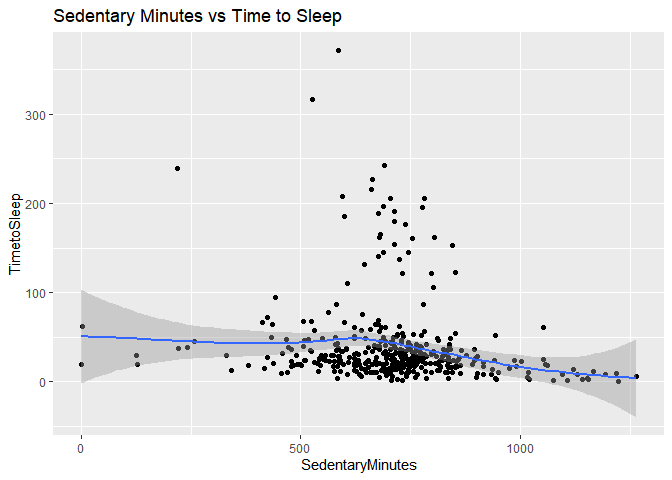<!-- -->

-   We could not find any meaningful relationship here, either. Time to
    fall asleep is mostly independent from these two variables.

## INSIGHTS

-   A good amount of users have some trouble with sleep. Some of them is
    spending a lot of in time trying to sleep, some of them are having
    too much or too little sleep. Time product can focus more on sleep
    schedule.It can give pop up notifications to users about their sleep
    time and also some advises about how to improve their sleep.
-   Bellabeat can encourage people to use the product more actively.
    They should more research about sedentary users and encourage them
    to make exercises. They can organize an event to raise awareness
    about how many people just spends most of the day.This will help
    marketing of the product.
-   They can focus on the calories track of the product. We can clearly
    see that more active users lose more calories in a day. People who
    want to lose weight can track their progress with this product. Also
    Bellabeat can provide a diet and workout schedule for making it
    easier to track.
